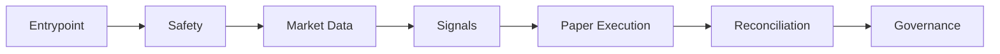

# Unified Architecture Target

## Objective

Define the single canonical runtime target under `src/sonic_xrpl/` and the
migration path from three surfaces (`app/`, `execution_prototype/`,
`src/sonic_xrpl/`) to one.

Canonical future runtime: `src/sonic_xrpl/`.

## Architecture Diagram



Pipeline:

`Entrypoint -> Safety -> Market Data -> Signals -> Paper Execution -> Reconciliation -> Governance`

## Post-Migration File Organization

Target runtime shape:

```text
src/sonic_xrpl/
├── main.py (unified runtime entrypoint)
├── core/ (safety, modes, config)
├── providers/ (market data - canonical)
├── signals/ (discovery + scoring)
├── execution/ (paper + future gated live_guard)
├── outcomes/ (reconciliation)
└── calibration/ (governance chain)
```

Current-to-target mapping for governance:

- `calibration_review/`
- `calibration_proposal/`
- `calibration_approval/`
- `calibration_implementation_plan/`

These are converged into the target logical `calibration/` layer after runtime
convergence and safety gate completion.

## Layer Contracts

### Safety Layer Interface

- Unified runtime entrypoint must call a single safety gate before any
  execution path.
- `assert_can_submit(...)` remains fail-closed unless explicit future phase
  enables live behavior under new gates.
- `block_signing()`, `block_autofill()`, and
  `block_wallet_construction()` remain hard-fail guards.

Contract outcome:

- If runtime mode or safety flags are invalid, execution path returns blocked
  result or raises safety error.

### Market Data Freshness Contract

- Provider output must include deterministic freshness metadata (snapshot time,
  source, and staleness classification).
- Strategy/signal layer must reject stale/unverifiable data for execution
  intent generation.
- No hidden polling loops: freshness updates must be explicit and auditable.

Contract outcome:

- Stale or unverifiable market data cannot produce executable intent.

### Execution Intent -> Result Reconciliation Contract

- Every intent must have immutable IDs and traceable lifecycle events.
- Paper execution result must reconcile against recorded outcome metadata.
- Reconciliation must classify matched, missing, diverged, and delayed states.

Contract outcome:

- End-to-end trace from intent to outcome/reconciliation record is mandatory.

### Governance Non-Mutation Contract

- Calibration/governance chain is advisory and non-mutating by default.
- Proposal/approval/implementation-plan artifacts do not directly alter runtime
  thresholds.
- All changes require explicit human approval and separate controlled rollout.

Contract outcome:

- Governance artifacts cannot mutate runtime settings in-process.

## Migration Steps (3 Surfaces -> 1 Surface)

### Step 1: Entrypoint and API Convergence

Files:

- `app/main.py`
- `app/api/`
- new `src/sonic_xrpl/main.py`
- new `src/sonic_xrpl/api/` (or equivalent CLI/API boundary)

Safety gates:

- `python -m pytest tests/test_execution_guard.py`
- `python -m pytest tests/unit/test_live_guard.py`
- `python -m pytest tests/safety/test_safety_scan.py`
- `python scripts/safety_grep.py`

### Step 2: Execution/Paper Path Convergence

Files:

- `app/execution/pipeline.py`
- `app/execution/paper.py`
- `src/sonic_xrpl/execution/` integration modules

Safety gates:

- Step 1 gates plus:
- `PYTHONPATH=src python -m sonic_xrpl.cli.main safety-scan`

### Step 3: Market Data and Signal Canonicalization

Files:

- `app/market_data/`
- `src/sonic_xrpl/providers/`
- `src/sonic_xrpl/market/`
- `src/sonic_xrpl/signals/`

Safety gates:

- Step 2 gates plus:
- `PYTHONPATH=src python -m sonic_xrpl.cli.main audit`

### Step 4: Reconciliation and Governance Unification

Files:

- `src/sonic_xrpl/outcomes/`
- `src/sonic_xrpl/reconciliation/`
- governance chain modules under calibration packages

Safety gates:

- Step 3 gates plus:
- `python scripts/audit_validator.py`
- `git diff --check`

### Step 5: Legacy Surface Freeze Finalization

Files:

- `app/` as compatibility shell only or archive
- `execution_prototype/` remains reference/test-only

Safety gates:

- Full suite from Steps 1-4 remains green.
- No runtime behavior regressions.

## Scaffolding Test Plan (No Behavior Change)

Add test-only scaffolding:

1. Unified runtime safety test:
   - Verify fail-closed behavior remains true in current guards.
2. Layer contract tests:
   - Verify required architecture contract sections and canonical module
     boundaries exist.

These tests are contract scaffolding and do not change runtime behavior.
